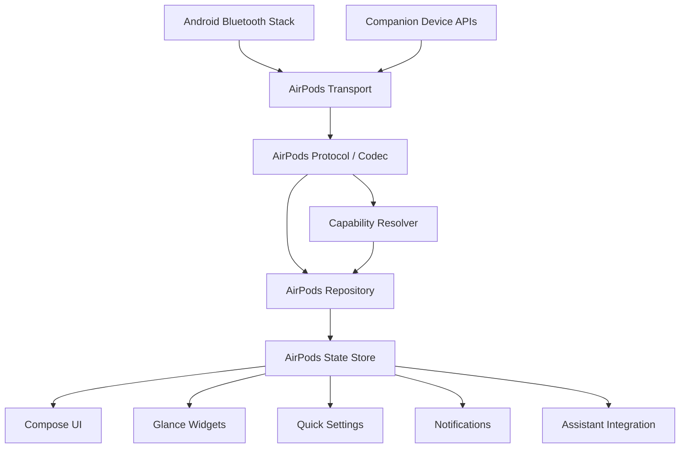

# Androidpods — Project Specification

> **Repository:** `TimStebner/Androidpods`  
> **Platform:** Android  
> **Language:** Kotlin  
> **Primary IDE:** Android Studio  
> **Primary UI toolkit:** Jetpack Compose + Material 3 Expressive  
> **Primary target:** Android 17 / API 37  
> **Document status:** Project source of truth  
> **Baseline verified:** 2026-08-12

---

## 1. Project Vision

**Androidpods** is a native Android companion application for Apple AirPods.

The goal is to provide Android users with the richest AirPods experience technically possible outside the Apple ecosystem, while feeling like a first-class modern Android application rather than an iOS clone.

Androidpods should combine:

- deep AirPods control,
- native Android integration,
- low battery consumption,
- high performance,
- modern Android 17 behavior,
- and a playful, highly polished Material 3 Expressive experience.

The app should expose AirPods features such as noise control, battery information, ear detection, configurable controls, assistant triggering, and model-specific settings wherever technically possible.

The product must be honest about hardware, firmware, Android-version, OEM, and protocol limitations. Features that are unavailable on a given device must be capability-gated instead of shown as broken controls.

---

## 2. Core Product Principles

### 2.1 Native Android first

Androidpods must behave like a modern Android application.

Use native Android platform capabilities instead of imitating iOS behavior where Android already provides a better integration point.

Examples:

- Edge-to-edge layouts
- Predictive back
- Adaptive layouts
- Dynamic Color
- Quick Settings tiles
- Android widgets
- Android assistant integration
- Companion Device APIs
- Notifications
- Haptic feedback
- Android accessibility APIs

### 2.2 AirPods are the product hero

The UI should not feel like a generic settings application.

The connected AirPods, their state, and their physical interaction are the visual and interaction center of the app.

Examples:

- left/right AirPod visually react to in-ear state,
- battery changes animate,
- noise-control transitions have expressive motion,
- connection state changes feel physical,
- case state can influence the device illustration,
- controls are contextual to the connected model.

### 2.3 Event-driven, not polling-driven

Battery life is a first-class requirement.

Androidpods must react to Bluetooth and AirPods protocol events whenever possible instead of continuously polling hardware.

The default architecture should allow the application to remain almost completely idle while AirPods are not present.

### 2.4 Capability-driven UI

Never assume that every AirPods model supports the same features.

The protocol layer must expose capabilities, and the UI must derive available controls from those capabilities.

### 2.5 Modern but stable toolchain

Use the newest **stable and fully compatible** build toolchain.

Preview dependencies may be used only where they are required for features that are intentionally part of Androidpods, especially Material 3 Expressive.

Do not use preview versions merely because they are newer.

### 2.6 No fake functionality

Do not present an option as supported until it is actually implemented and validated against real hardware or a trustworthy protocol test fixture.

Unsupported features should be clearly marked as unavailable, experimental, or planned.

---

## 3. Platform Baseline

### 3.1 SDK targets

```text
compileSdk = 37
targetSdk  = 37
minSdk     = 29
```

`minSdk 29` is the initial compatibility floor because the project expects to use modern public Bluetooth/L2CAP APIs while still supporting a meaningful range of Android devices.

Android 17 / API 37 is the **reference platform** and must receive first-class support.

Advanced AirPods protocol features may require newer Android Bluetooth stack behavior even when the application itself can install on older supported Android versions.

### 3.2 Android 17 requirements

Androidpods must be designed and tested for Android 17 behavior from the beginning.

Relevant platform behavior should be adopted natively, including:

- edge-to-edge UI,
- modern system bar handling,
- predictive back where applicable,
- adaptive and resizable layouts,
- large-screen behavior,
- current Bluetooth behavior,
- current background execution restrictions,
- current notification behavior,
- current accessibility expectations,
- current foreground-service rules.

Do not add an API 37 feature simply to claim API usage. Adopt features where they improve Androidpods or are required for correct platform behavior.

---

## 4. Verified Build Baseline

The following baseline was verified on **2026-08-12**.

| Component | Baseline |
|---|---|
| Android Studio | Quail 2 / 2026.1.2 Patch 1 |
| Android Gradle Plugin | 9.3.1 |
| Gradle | 9.5.0 |
| Kotlin | 2.4.10 |
| compileSdk | 37 |
| targetSdk | 37 |
| Material 3 stable | 1.4.0 |
| Material 3 Expressive track | 1.5.0-alpha25 |
| Compose UI stable line | 1.11.4 |

### Why Gradle 9.5.0 instead of 9.6.0?

Gradle 9.6.0 exists, but the Kotlin 2.4.10 documentation currently identifies Gradle 9.5.0 as the highest fully supported version, and AGP 9.3 also uses Gradle 9.5.0 as its default compatibility baseline.

Therefore:

> Prefer the newest fully supported combination over the newest independent version number.

### Dependency version policy

Exact dependency versions belong in `gradle/libs.versions.toml`.

Before upgrading any dependency:

1. verify the latest stable release,
2. verify AGP/Kotlin/Gradle compatibility,
3. verify Android API 37 compatibility,
4. run unit tests,
5. run instrumentation tests,
6. run Compose/UI tests,
7. run Bluetooth integration tests where applicable,
8. validate startup time and battery-impact regressions.

Never use dynamic versions such as `1.+`, `latest.release`, or equivalent.

---

## 5. Technology Stack

### Required

- Kotlin
- Android Studio
- Gradle Kotlin DSL
- Gradle Version Catalog
- Jetpack Compose
- Material 3
- Material 3 Expressive
- Kotlin Coroutines
- Kotlin Flow / StateFlow
- Android Bluetooth APIs
- Companion Device APIs where appropriate
- DataStore
- Jetpack Glance for widgets
- Android Quick Settings APIs
- Android Notification APIs
- Android Haptics APIs

### Preferred

- Hilt for dependency injection
- Navigation 3 for app navigation when production-ready for the required use cases
- Kotlin Serialization for internal structured data where useful
- immutable UI state models
- repository-based data boundaries
- unidirectional data flow

Libraries must not be introduced for functionality that Android or Kotlin already provides cleanly.

---

## 6. Material 3 Expressive Design System

Material 3 Expressive is a core product requirement, not a decorative layer.

Androidpods should use the official expressive APIs wherever appropriate.

### 6.1 Theme

The app should be built around the expressive theme system.

Conceptually:

```kotlin
MaterialExpressiveTheme(
    colorScheme = androidpodsColorScheme,
    motionScheme = MotionScheme.expressive(),
    shapes = androidpodsShapes,
    typography = androidpodsTypography,
) {
    AndroidpodsApp()
}
```

Experimental Material 3 Expressive APIs must be isolated behind the Androidpods design-system layer where practical so future API changes do not spread across the entire application.

### 6.2 Dynamic Color

Dynamic Color should be supported on compatible Android devices.

The application should also provide a carefully designed fallback color scheme so Androidpods retains a distinct visual identity when Dynamic Color is unavailable or disabled.

### 6.3 Motion

Motion is a functional part of the experience.

Prefer expressive spring-based and physics-inspired transitions for:

- state changes,
- selection changes,
- device connection,
- battery changes,
- AirPod in-ear transitions,
- noise-control mode changes,
- expanding controls,
- navigation transitions,
- shape morphing,
- loading states.

Motion must remain responsive and should never delay actual functionality.

Respect system animation accessibility settings.

### 6.4 Shapes

Use expressive shape language and shape morphing intentionally.

Examples:

- noise-control selectors,
- connection cards,
- battery surfaces,
- assistant controls,
- active navigation item,
- device cards,
- loading indicators.

Do not make every component visually loud. Expressiveness needs hierarchy.

### 6.5 Navigation

Phone layouts should use a compact floating/pill-like bottom navigation treatment based on the current Material 3 navigation APIs.

Initial top-level destinations:

1. **Home**
2. **Controls**
3. **Widgets**
4. **Settings**

On larger screens, navigation should adapt to the available window size rather than stretching the phone layout.

### 6.6 Haptics

Haptics must communicate meaning.

Examples:

| Interaction | Haptic intent |
|---|---|
| Noise mode selected | segmented tick |
| Toggle enabled | toggle on |
| Toggle disabled | toggle off |
| Long press accepted | long press |
| Slider snap | frequent segment tick |
| Successful connection | confirmation |
| Failed action | rejection/error feedback |

Do not vibrate on every interaction.

---

## 7. User Experience Direction

### 7.1 Home screen

The Home screen is the primary device dashboard.

It should prioritize:

- connected AirPods model,
- connection state,
- large device visualization,
- left battery,
- right battery,
- case battery,
- charging state,
- active noise-control mode,
- important contextual features,
- fast access to frequently used controls.

Example information hierarchy:

```text
Androidpods

AirPods
Connected

[ expressive device visualization ]

Left       Case       Right
 92%        71%         88%

Noise Control
Off · Transparency · Adaptive · ANC

Automatic Ear Detection         On
Conversation Awareness          On
```

Only capabilities actually supported by the connected model may be shown as actionable controls.

### 7.2 Controls screen

Contains model-dependent AirPods settings.

Possible groups:

- Noise Control
- Stem / Button Actions
- Digital Assistant
- Press Speed
- Press-and-Hold Duration
- Call Controls
- Microphone Preference
- Ear Detection
- Head Gestures
- Conversation Awareness
- Personalized Volume
- Accessibility-related AirPods controls

### 7.3 Widgets screen

Allows users to preview and configure Androidpods widgets.

### 7.4 Settings screen

Contains Androidpods-level settings rather than AirPods device controls.

Examples:

- appearance,
- Dynamic Color,
- connection notifications,
- popup behavior,
- auto-pause behavior,
- auto-resume behavior,
- diagnostics,
- privacy,
- experimental features,
- about,
- protocol/debug information in developer mode.

---

## 8. Feature Scope

### 8.1 Core features

Androidpods should aim to provide:

- AirPods discovery and identification
- AirPods connection awareness
- AirPods model/generation detection
- capability detection
- left AirPod battery
- right AirPod battery
- charging-case battery
- charging state
- automatic in-ear detection
- pause when removed
- optional resume when inserted
- ANC control
- Transparency Mode
- Adaptive Audio where supported
- button/stem action configuration
- digital assistant triggering
- pressure/press speed configuration
- press-and-hold duration
- head gestures where supported
- Conversation Awareness where supported
- Personalized Volume where supported
- call controls where supported
- microphone preference where supported
- device/firmware information when available
- connection popup/notification experience
- Android widgets
- Quick Settings integration
- haptic feedback
- adaptive Material 3 Expressive UI

### 8.2 Target device families

The architecture must be able to support all AirPods families and generations through model/capability descriptors, including:

- AirPods
- AirPods Pro
- AirPods Max

No generation may be assumed to have feature parity with another.

### 8.3 Experimental / future scope

Potential future work:

- deeper spatial/head-tracking integration,
- advanced multipoint behavior,
- Find My-like local functionality,
- last-known-location assistance,
- additional accessibility/hearing-related controls,
- advanced protocol features discovered through research.

These features are not part of the core v1 promise until proven reliable.

### 8.4 Explicit non-goals for v1

Do not make the initial release depend on:

- root access,
- Xposed,
- modified Android system images,
- Apple ID access,
- iCloud integration,
- Apple's Find My network,
- AirPods firmware flashing/updating,
- unsafe Bluetooth stack modifications.

Root-only experiments may later exist in a clearly separated research branch or experimental module, but the normal application must remain a standard Android app.

---

## 9. Capability Model

The central rule:

> UI renders capabilities. It does not infer them.

Example:

```kotlin
data class AirPodsCapabilities(
    val battery: Boolean,
    val caseBattery: Boolean,
    val earDetection: Boolean,
    val noiseCancellation: Boolean,
    val transparency: Boolean,
    val adaptiveAudio: Boolean,
    val conversationAwareness: Boolean,
    val personalizedVolume: Boolean,
    val assistantAction: Boolean,
    val pressSpeed: Boolean,
    val pressAndHoldDuration: Boolean,
    val volumeSwipe: Boolean,
    val headGestures: Boolean,
    val microphonePreference: Boolean,
    val callControls: Boolean,
)
```

Capabilities should be determined from combinations of:

- product/model identifier,
- AirPods generation,
- firmware version,
- protocol behavior,
- Android Bluetooth stack support,
- runtime feature probing where safe.

Unknown capability must not be treated as supported.

---

## 10. State Model

All UI and Android integrations should consume a shared immutable device state.

Example:

```kotlin
data class AirPodsState(
    val connection: ConnectionState,
    val device: AirPodsDevice?,
    val capabilities: AirPodsCapabilities,
    val battery: AirPodsBatteryState?,
    val wearState: AirPodsWearState?,
    val noiseControlMode: NoiseControlMode?,
    val settings: AirPodsSettings,
    val lastUpdatedAt: Instant?,
)
```

The state should be exposed through `StateFlow`.

Widgets, notifications, Quick Settings, and Compose UI should derive from the same authoritative state where practical.

Avoid separate duplicated Bluetooth state machines for each feature.

---

## 11. Architecture

Use a layered architecture that strongly separates protocol work from presentation.



### Architectural boundaries

#### Transport layer

Responsible only for:

- Bluetooth socket/channel creation,
- connection lifecycle,
- reads/writes,
- packet framing transport,
- reconnection policy,
- Android Bluetooth errors.

It must not contain UI logic.

#### Protocol layer

Responsible for:

- AirPods packet parsing,
- command encoding,
- protocol constants,
- event decoding,
- model identifiers,
- protocol version handling.

It must not know about Compose.

#### Repository layer

Responsible for:

- high-level operations,
- state coordination,
- feature requests,
- capability enforcement,
- persistence where required.

Examples:

```kotlin
interface AirPodsRepository {
    val state: StateFlow<AirPodsState>

    suspend fun setNoiseControlMode(mode: NoiseControlMode)
    suspend fun setEarDetectionEnabled(enabled: Boolean)
    suspend fun setAssistantAction(side: AirPodSide)
}
```

#### Presentation layer

Responsible for:

- rendering state,
- user interaction,
- animations,
- accessibility,
- navigation.

The presentation layer must never construct raw AirPods protocol packets.

---

## 12. Suggested Project Structure

Start simple. Do not create dozens of Gradle modules before the codebase needs them.

Recommended early structure:

```text
Androidpods/
├── app/
│
├── core/
│   ├── common/
│   ├── model/
│   ├── bluetooth/
│   ├── airpods/
│   ├── data/
│   └── designsystem/
│
├── feature/
│   ├── onboarding/
│   ├── home/
│   ├── controls/
│   ├── widgets/
│   └── settings/
│
├── build-logic/
│
├── gradle/
│   └── libs.versions.toml
│
├── PROJECT.md
└── README.md
```

These may initially be package boundaries inside a smaller number of Gradle modules.

Create a new Gradle module only when it provides a real boundary, build-performance benefit, ownership boundary, or reusable component.

---

## 13. Bluetooth Strategy

### 13.1 General approach

Use public Android Bluetooth APIs wherever possible.

The AirPods protocol implementation must be isolated so protocol research can evolve without destabilizing the rest of the app.

### 13.2 Connection behavior

Desired lifecycle:

```text
No AirPods nearby
    ↓
Application remains idle

Known AirPods become present/connected
    ↓
Companion/device event activates required component

Protocol connection established
    ↓
AirPods events update shared state

AirPods disconnected
    ↓
Transport closes
State is persisted if useful
Background work stops
```

### 13.3 No permanent scanning

Do not run continuous unrestricted Bluetooth discovery.

Scanning should be:

- user initiated during onboarding,
- constrained to required discovery windows,
- stopped immediately when unnecessary,
- replaced with association/presence APIs where possible.

### 13.4 No aggressive polling

Never poll battery or device state every few seconds as a default design.

Preferred priority:

1. AirPods protocol event
2. Bluetooth system event
3. cached state
4. conservative fallback polling only when unavoidable

Fallback polling must be documented and measurable.

---

## 14. Background Execution and Battery Policy

Battery efficiency is a release requirement.

Prefer:

- Companion Device APIs,
- event-driven callbacks,
- short-lived work,
- shared connections,
- system scheduling,
- state caching.

Avoid:

- permanent wake locks,
- high-frequency timers,
- continuous BLE scans,
- always-running foreground services,
- duplicate protocol connections,
- frequent widget refresh timers.

A `connectedDevice` foreground service may be used only when technically required and only for the duration of active device communication that cannot be implemented reliably through a more efficient lifecycle.

### Battery acceptance principle

When AirPods are disconnected and no Androidpods task is running, Androidpods should consume effectively negligible background resources.

---

## 15. Performance Requirements

### UI

- Target smooth rendering at the device refresh rate.
- Avoid unnecessary recomposition.
- Use stable/immutable state models.
- Keep expensive work off the main thread.
- Avoid decoding large assets repeatedly.
- Prefer vector/procedural UI assets where practical.
- Profile expressive animations on mid-range hardware.

### Bluetooth

- One authoritative transport connection per connected AirPods device.
- No duplicated listeners.
- No blocking I/O on the main thread.
- Parse packets efficiently.
- Bound buffers and queues.
- Handle corrupted/unknown packets safely.

### Startup

The app shell should open without waiting for Bluetooth protocol initialization.

Bluetooth/device state can populate asynchronously.

### Release builds

Enable and validate:

- R8 optimization,
- resource shrinking,
- baseline/startup profiles where beneficial,
- release-specific logging reduction.

---

## 16. Ear Detection and Media Control

Ear detection should be driven by AirPods wear-state events.

Expected behavior:

```text
AirPod removed
    ↓
Wear state changes
    ↓
Androidpods evaluates user preference
    ↓
Pause active playback if allowed
```

Auto-resume should be optional.

Media integration must respect Android's media/session model. Androidpods should not aggressively steal media controls from the currently active media application.

---

## 17. Digital Assistant Integration

The product concept is:

```text
AirPods gesture
    ↓
Assistant action
    ↓
Android system / selected assistant
```

Do not hard-code Gemini as the only assistant.

Gemini can be an expected common target, but Androidpods should prefer system-level assistant behavior or a configurable supported assistant integration.

The AirPods protocol side and Android assistant side must remain separate abstractions.

---

## 18. Noise Control

Noise-control modes should be represented by a single domain model.

Example:

```kotlin
enum class NoiseControlMode {
    OFF,
    TRANSPARENCY,
    ADAPTIVE,
    NOISE_CANCELLATION,
}
```

The capability layer determines which values are valid for the connected device.

The UI must not show unsupported modes as active choices.

Noise processing itself is performed by the AirPods. Androidpods only configures the supported device mode.

---

## 19. Connection Experience

Androidpods should provide an expressive connection experience.

### When the app is visible

A rich Material 3 Expressive connection surface may show:

- device illustration,
- model,
- connection state,
- left/right/case battery,
- charging state,
- short connection animation.

### When the app is not visible

Respect Android background-launch restrictions.

Use supported Android surfaces such as:

- notifications,
- companion-device integrations,
- other platform-approved surfaces.

Do not depend on abusive overlay permissions to imitate the iOS pairing animation.

---

## 20. Widgets

Widgets are a first-class Androidpods feature.

Initial widget concepts:

### Battery widget

Shows:

- model/device name,
- left battery,
- right battery,
- case battery,
- charging state.

### Noise Control widget

Allows quick access to supported modes:

- Off
- Transparency
- Adaptive
- ANC

### Combined control widget

Shows battery plus frequently used controls.

Widgets should update when meaningful device state changes rather than on aggressive fixed polling intervals.

Use Jetpack Glance unless a platform limitation requires another implementation.

---

## 21. Quick Settings

Provide native Android Quick Settings integration.

Potential tiles:

- Noise Control
- ANC
- Transparency

A general Noise Control tile may cycle through only the modes supported by the connected AirPods.

Tile state must reflect actual device state rather than merely the user's last requested action.

---

## 22. Persistence

Use DataStore for application preferences and lightweight persisted state.

Possible persisted information:

- known/associated device metadata,
- user preferences,
- auto-pause setting,
- auto-resume setting,
- appearance preferences,
- widget configuration,
- popup preferences,
- experimental-feature flags,
- cached last-known non-sensitive device state.

Do not persist raw protocol traffic by default.

Debug packet logging must be explicitly opt-in.

---

## 23. Permissions

Request the minimum permissions required for the currently used feature.

Permission UX must explain the user benefit.

Potential Android permissions/API access may include:

- nearby Bluetooth device access,
- notifications,
- companion device association,
- optional location only if a location-based feature is intentionally added.

Do not request location merely because legacy Bluetooth implementations once required it on old Android versions.

---

## 24. Privacy

Androidpods should be local-first.

Core AirPods functionality must not require an Androidpods cloud account.

Default expectations:

- no advertising SDK,
- no sale of user data,
- no unnecessary analytics,
- no raw Bluetooth traffic upload,
- no background location collection,
- no cloud dependency for core controls.

If telemetry is added later, it must be:

- privacy-preserving,
- documented,
- minimal,
- optional where practical.

---

## 25. Protocol Research and Licensing Rules

AirPods use Apple-controlled and partly proprietary protocols.

Protocol work must be treated as a dedicated engineering/research area.

### Rules

- Prefer public Android APIs.
- Document protocol discoveries.
- Maintain packet fixtures for tests where legally and technically appropriate.
- Do not blindly copy third-party implementations.
- Review licenses before using any external source code.
- Keep third-party notices accurate.
- Do not copy GPL-licensed implementation code into a differently licensed proprietary or permissive codebase unless the project intentionally accepts the resulting license obligations.
- Reverse-engineering references may inform behavior, but implementation provenance must remain clear.
- Do not implement firmware flashing in the core app.

The project must not claim affiliation with, endorsement by, or ownership by Apple.

AirPods and Apple trademarks remain the property of their respective owner.

---

## 26. Error Handling

Bluetooth and accessory communication will fail in normal real-world use.

Treat these as expected states:

- Bluetooth disabled,
- permission denied,
- AirPods disconnected,
- AirPods reconnecting,
- protocol channel unavailable,
- unsupported firmware,
- unsupported model,
- command rejected,
- command timeout,
- stale battery state,
- partial left/right state,
- case not currently reachable.

The UI should communicate recoverable states without frightening the user.

Protocol failures should never crash the app.

---

## 27. Logging and Diagnostics

Use structured logging.

Suggested levels:

- `ERROR`: unexpected failures requiring investigation
- `WARN`: degraded behavior / unsupported response
- `INFO`: high-level lifecycle events in debug builds
- `DEBUG`: protocol/state details
- `VERBOSE`: raw packet diagnostics, disabled by default

Never log sensitive identifiers unnecessarily.

Raw protocol packet logging must be disabled in production by default.

A developer diagnostics screen may later expose:

- detected model,
- firmware version,
- capabilities,
- connection type,
- protocol status,
- last protocol error,
- optional sanitized packet diagnostics.

---

## 28. Testing Strategy

### Unit tests

Required for:

- protocol encoding,
- protocol decoding,
- capability resolution,
- state reducers,
- repository behavior,
- domain validation,
- settings serialization.

### Protocol fixture tests

Captured or synthetic packet fixtures should verify:

- known packet parsing,
- unknown field tolerance,
- malformed packet handling,
- firmware variation behavior.

### UI tests

Cover critical flows:

- onboarding,
- connected dashboard,
- disconnected dashboard,
- noise mode switching,
- unsupported capability behavior,
- settings changes,
- permission denial,
- accessibility semantics.

### Hardware integration tests

Real AirPods hardware testing is mandatory for functionality that writes settings.

Maintain a test matrix containing:

- AirPods family/model,
- generation,
- firmware,
- Android version,
- Android device/OEM,
- supported features,
- known limitations.

### Performance tests

Measure:

- startup,
- Compose frame performance,
- Bluetooth event throughput,
- reconnect behavior,
- memory,
- background battery impact.

---

## 29. Accessibility

Expressive design must remain accessible.

Requirements:

- semantic labels for interactive elements,
- scalable text,
- minimum touch targets,
- contrast compliance,
- TalkBack support,
- no color-only state communication,
- reduced-motion behavior,
- haptics are enhancement, never the only feedback,
- large-screen/foldable usability.

AirPods visualizations must not hide essential information from assistive technologies.

---

## 30. Coding Standards

### Kotlin

Prefer:

- idiomatic Kotlin,
- explicit domain types,
- sealed interfaces/classes for finite state,
- immutable data,
- Coroutines,
- Flow,
- extension functions only where they improve clarity,
- small focused interfaces.

Avoid:

- global mutable state,
- `GlobalScope`,
- blocking calls on Main,
- unchecked protocol parsing,
- broad exception swallowing,
- giant manager classes,
- unnecessary abstraction layers.

### Compose

Prefer:

- state hoisting,
- unidirectional data flow,
- immutable UI models,
- previewable components,
- reusable design-system primitives,
- animation APIs tied to state.

Avoid:

- business logic inside composables,
- Bluetooth access inside composables,
- side effects without controlled lifecycle,
- deeply nested ad-hoc styling,
- magic dimensions scattered through feature code.

### Naming

Code identifiers and source-code comments should be English.

User-facing strings must be Android resources and designed for future localization.

---

## 31. Source of Truth Rules for AI Coding Agents

This file is authoritative for project-level decisions unless superseded by a newer explicit project document or maintainer instruction.

When using Codex, Claude Code, Gemini, or another coding agent:

1. Read `PROJECT.md` before implementing a feature.
2. Check the existing code before inventing new architecture.
3. Use current official Android documentation for Android platform APIs.
4. Use current official Kotlin documentation for Kotlin.
5. Use current Material 3 / Compose documentation for UI APIs.
6. Verify experimental API names before using them.
7. Do not invent Android or AirPods APIs.
8. Do not silently downgrade the project to older library versions.
9. Do not introduce polling where an event-driven solution exists.
10. Do not introduce a permanent foreground service without justification.
11. Do not bypass the capability model.
12. Do not place raw protocol operations in UI code.
13. Do not copy third-party GPL code into the project without an explicit licensing decision.
14. Add tests for protocol behavior and capability logic.
15. Preserve Material 3 Expressive design and motion principles.
16. Preserve accessibility.
17. Preserve battery-efficiency requirements.
18. Update documentation when an architectural decision changes.

When documentation and memory disagree, current official documentation wins.

---

## 32. Implementation Milestones

### Milestone 0 — Project bootstrap

- Create Android Studio project
- Configure API 37
- Configure compatible current toolchain
- Add Version Catalog
- Add Compose
- Add Material 3 Expressive
- Add design-system foundation
- Add CI build/test workflow
- Add lint/static checks
- Add package/module boundaries

### Milestone 1 — Bluetooth foundation

- Permission flow
- Bluetooth availability state
- AirPods discovery
- known-device association
- model identification
- transport abstraction
- connect/disconnect state machine
- protocol logging in debug mode

### Milestone 2 — Read-only AirPods state

- protocol decoding
- capability resolver
- battery L/R/case
- charging state
- wear detection
- firmware/model info
- Home dashboard

This milestone should prove the architecture before sending configuration commands.

### Milestone 3 — Core controls

- ANC
- Transparency
- Adaptive Audio
- supported device setting writes
- error recovery
- actual-state confirmation after writes

### Milestone 4 — Interaction features

- automatic pause
- optional automatic resume
- AirPods button/stem settings
- assistant triggering
- press speed
- press-and-hold duration
- supported head gestures

### Milestone 5 — Android integration

- connection experience
- notifications
- battery widget
- noise-control widget
- combined widget
- Quick Settings tile(s)

### Milestone 6 — Polish and compatibility

- adaptive layouts
- tablet/foldable validation
- accessibility audit
- performance profiling
- battery profiling
- hardware compatibility matrix
- reconnect robustness
- protocol edge cases
- release hardening

### Milestone 7 — Experimental features

Only after the stable core is mature:

- deeper spatial/head tracking research,
- advanced model-specific features,
- local Find My-like assistance,
- additional accessibility/hearing features,
- advanced multi-device behavior.

---

## 33. Definition of Done

A feature is not complete because its UI exists.

A feature is complete only when:

- the feature is capability-gated,
- the domain/API behavior is implemented,
- failure behavior is handled,
- real device state is reflected,
- tests exist,
- accessibility is considered,
- battery impact is acceptable,
- the UI follows the Androidpods design system,
- relevant documentation is updated,
- no unsupported behavior is presented as working.

For AirPods configuration commands, real-hardware validation is required before the feature is considered production-ready.

---

## 34. Success Criteria

Androidpods succeeds when an Android user can connect compatible AirPods and experience them as a deeply integrated Android accessory without needing an Apple device for everyday controls.

The application should feel:

- native,
- fast,
- playful,
- polished,
- expressive,
- predictable,
- battery-efficient,
- trustworthy.

The engineering priority order is:

1. **Correctness**
2. **Reliability**
3. **Battery efficiency**
4. **Performance**
5. **Accessibility**
6. **User experience**
7. **Feature breadth**

A visually impressive feature that is unreliable or drains battery is not acceptable.

---

## 35. Official Reference Sources

These sources should be preferred when validating platform or toolchain decisions:

- Android Developers — Android 17  
  https://developer.android.com/about/versions/17

- Android Developers — Android Studio releases  
  https://developer.android.com/studio/releases

- Android Developers — Android Gradle Plugin  
  https://developer.android.com/build/releases/about-agp

- Android Developers — Jetpack Compose releases  
  https://developer.android.com/jetpack/androidx/releases/compose

- Android Developers — Compose Material 3 releases  
  https://developer.android.com/jetpack/androidx/releases/compose-material3

- Material Design 3  
  https://m3.material.io/

- Kotlin documentation  
  https://kotlinlang.org/docs/home.html

- Gradle releases  
  https://gradle.org/releases/

---

## 36. Project Motto

> **Make AirPods feel native on Android.**
