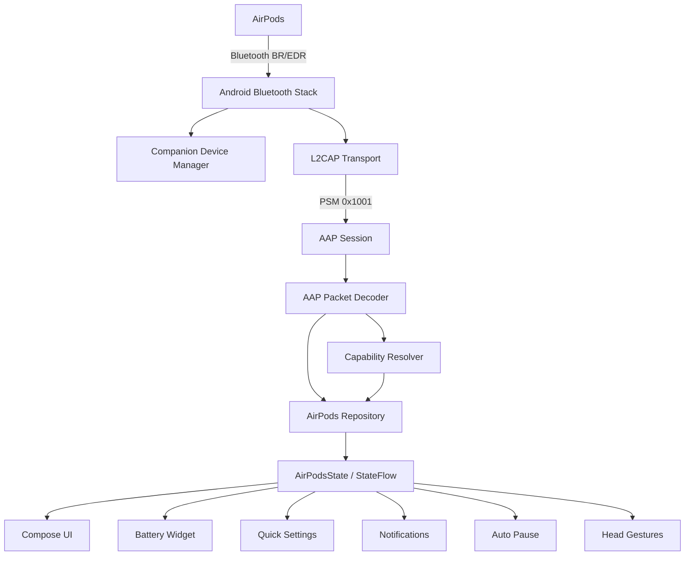

<div align="center">

# Androidpods

### Bring AirPods closer to a first-class Android experience.

A native Android companion app for Apple AirPods, built with **Kotlin**, **Jetpack Compose** and **Material 3 Expressive**.

Androidpods brings battery information, ear detection, head gestures, widgets, notifications, motion data and deeper AirPods integration to Android — without trying to turn Android into iOS.

<br>


[](LICENSE)

</div>

---

## About Androidpods

AirPods work as standard Bluetooth headphones on Android, but much of the experience available inside Apple's ecosystem is normally missing.

**Androidpods aims to close that gap.**

The project communicates directly with compatible AirPods using Apple's accessory protocol and combines that data with native Android platform features.

The result is an AirPods companion designed specifically for Android:

- native Android UI instead of an iOS clone
- Material 3 Expressive design and motion
- live AirPods battery information
- automatic ear detection
- head-motion and gesture support
- Android widgets and Quick Settings
- connection and battery notifications
- local Find My-style audio chimes
- capability-aware controls for different AirPods generations

All while remaining a normal, **rootless Android application**.

---

## Features

| Feature | Status |
|---|:---:|
| Left / Right AirPod battery | ✅ |
| Charging case battery | ✅ |
| Charging-state detection | ✅ |
| Automatic ear detection | ✅ |
| Auto-pause when removing an AirPod | ✅ |
| Optional auto-resume | ✅ |
| Material 3 Expressive battery pop-up | ✅ |
| Battery home-screen widget | ✅ |
| Battery notification | ✅ |
| Connection notification | ✅ |
| Quick Settings tile | ✅ |
| AirPods model / generation detection | ✅ |
| Capability-based feature detection | ✅ |
| Press-speed configuration | ✅ |
| Press-and-hold configuration | ✅ |
| 50 Hz head-orientation / IMU stream | ✅ |
| 3D head-motion visualizer | ✅ |
| Nod / shake head-gesture detection | ✅ |
| Answer / decline calls using head gestures | ✅ |
| Find My-style earbud chime | ✅ |
| Dynamic Color | ✅ |
| Light / dark themes | ✅ |
| Noise Control read/write controls | ❌ Not implemented |
| Case-speaker chimes | ❌ Not implemented |
| Apple Find My network | ❌ Not supported |
| iCloud / Apple ID integration | ❌ Not required |

> **Important:** Androidpods does not expose unverified controls as if they were working. Hardware- and model-specific functionality is capability-gated until it has been validated.

---

## Material 3 Expressive

Androidpods is designed as a modern Android application from the ground up.

The UI uses **Material 3 Expressive** extensively instead of recreating Apple's settings screens.

Highlights include:

- expressive spring-based motion
- floating bottom navigation pill
- dynamic color
- custom light and dark color systems
- morphing shapes
- haptic feedback
- edge-to-edge layouts
- animated AirPods illustrations
- generation-specific device artwork
- animated battery indicators
- live waveform visualization
- reduced-motion support
- performance-oriented RenderNode animations

Continuous animations use deferred `graphicsLayer` state reads and reusable drawing primitives to minimize unnecessary Compose recompositions and per-frame allocations.

---

## AirPods Support

Androidpods uses model identifiers to resolve device capabilities instead of assuming that every AirPods generation behaves the same way.

Capability profiles currently exist for:

| AirPods family | Model recognition | Hardware validated |
|---|:---:|:---:|
| AirPods 1st generation | ✅ | — |
| AirPods 2nd generation | ✅ | — |
| AirPods 3rd generation | ✅ | — |
| **AirPods 4** | ✅ | ✅ |
| AirPods 4 with ANC | ✅ | — |
| AirPods Pro 1st generation | ✅ | — |
| AirPods Pro 2nd generation | ✅ | — |
| AirPods Max | ✅ | — |

### Current reference hardware

Development and real-device validation currently focus on:

- **Google Pixel 9 Pro XL**
- **Android 17 / API 37**
- **AirPods 4**
- Apple model numbers `A3050` / `A3053`

Support for additional AirPods generations is built into the architecture, but features that require protocol writes or hardware-specific behavior are only enabled after validation on physical hardware.

---

## Android Integration

Androidpods is more than an AirPods settings screen.

### Battery Widget

A Jetpack Glance home-screen widget displays live battery information for the left AirPod, right AirPod and charging case.

Updates are driven by the same application state used by the main UI.

### Battery & Connection Notifications

Androidpods can show:

- a low-priority AirPods battery notification
- an expressive connection notification when AirPods become available

### Quick Settings

A native Android Quick Settings tile provides fast access to the current AirPods state and the application.

### Automatic Ear Detection

AirPods wear-state packets can automatically pause media when an earbud is removed and optionally resume playback when it is inserted again.

### Head Gestures

On supported AirPods, Androidpods processes motion telemetry to recognize:

- **Nod**
- **Shake**

These gestures can be used for actions such as answering or declining incoming phone calls.

### Motion Visualization

Compatible H2 AirPods can expose a roughly **50 Hz IMU data stream**, allowing Androidpods to visualize head orientation in real time.

The stream is lifecycle-aware and automatically stops when it is no longer required to avoid wasting battery.

---

## How It Works

Androidpods communicates with AirPods below the normal Android Bluetooth audio layer.



### Transport

The core AirPods connection uses a rootless Classic Bluetooth **L2CAP** socket on PSM `0x1001`.

Access to the required Android socket API is provided through `HiddenApiBypass`, because the required platform API is not part of Android's public SDK.

### AAP

After opening the transport, Androidpods establishes an **Apple Accessory Protocol (AAP)** session.

Incoming packets are decoded into events such as:

- battery levels
- charging states
- wear state
- device information
- motion telemetry

These events are reduced into a single immutable application state.

### Single Source of Truth

```text
AirPods → Transport → AAP → Repository → AirPodsState
                                      ↓
                   UI / Widget / Tile / Notifications
```

The Compose UI, widgets, notifications and Android integrations consume the same authoritative `StateFlow` instead of maintaining independent Bluetooth state machines.

---

## Battery Efficiency

Bluetooth companion applications can easily become expensive background processes, so Androidpods is designed around an **event-driven architecture**.

The app avoids continuous polling wherever possible.

It uses Android's `CompanionDeviceManager` and `CompanionDeviceService` to react to device-presence and Bluetooth events, allowing Androidpods to remain largely idle when the AirPods are not available.

Additional optimizations include:

- no permanent BLE scan loop
- no permanent WakeLock
- lifecycle-bound IMU streaming
- filtered `StateFlow` observers
- `distinctUntilChanged` before system IPC where appropriate
- zero-allocation drawing paths for continuous animations
- RenderNode-driven animation state
- cached protocol capability information

---

## Privacy

Androidpods is designed to work locally.

See the full [Privacy Policy](PRIVACY.md).

The current release assessment is documented in the [Security, Performance and Deployment Review](SECURITY_PERFORMANCE_REVIEW.md). Its verdict remains **No-Go** until every listed hardware, signing and Play-policy gate passes.

It does **not** require:

- an Apple ID
- iCloud
- Apple's Find My network
- root access
- Xposed
- a modified Android system
- location permission

Bluetooth scanning is explicitly declared as **not being used for location**.

The current application manifest also does not request Android's `INTERNET` permission.

Optional permissions are only requested for features that need them, such as:

- notifications
- reading phone state for incoming-call gestures
- answering phone calls through head gestures

---

## Requirements

### To use Androidpods

- Android **16 / API 36 or newer**
- Android 17 / API 37 recommended
- Bluetooth-capable Android device
- compatible Apple AirPods
- AirPods paired through Android

No root access is required.

### To build Androidpods

- **JDK 21**
- **Android SDK 37**
- Android Studio or compatible Gradle environment

Current project baseline:

| Component | Version |
|---|---|
| Android Gradle Plugin | 9.3.1 |
| Kotlin | 2.4.10 |
| compileSdk | 37 |
| targetSdk | 37 |
| minSdk | 36 |
| Compose BOM | 2026.08.00 |
| Material 3 Expressive | 1.5.0-alpha26 |

---

## Building

Clone the repository:

```bash
git clone https://github.com/TimStebner/Androidpods.git
cd Androidpods
```

Build the debug APK:

```bash
./gradlew :app:assembleDebug
```

Run JVM unit tests:

```bash
./gradlew :app:testDebugUnitTest
```

Run Android Lint:

```bash
./gradlew :app:lintDebug
```

Build the optimized release bundle and run device benchmarks:

```bash
./gradlew :app:bundleRelease
./gradlew :benchmark:connectedBenchmarkAndroidTest
```

---

## Project Structure

```text
dev.androidpods
├── app/
│   ├── AndroidpodsApp
│   └── MainActivity
│
├── core/
│   ├── airpods/       # AAP protocol, packet decoding, capabilities
│   ├── audio/         # Chimes and Bluetooth audio routing
│   ├── bluetooth/     # L2CAP transport and Companion Device APIs
│   ├── data/          # Repository, StateFlow and DataStore
│   ├── designsystem/  # Material 3 Expressive design system
│   ├── gestures/      # Head gesture recognition
│   ├── media/         # Automatic pause / resume
│   └── telecom/       # Call control through head gestures
│
└── feature/
    ├── controls/
    ├── findmy/
    ├── home/
    ├── navigation/
    ├── notifications/
    ├── onboarding/
    ├── popup/
    ├── settings/
    ├── spatial/
    ├── tiles/
    └── widgets/
```

Production code intentionally remains in the single Gradle `app` module. The separate
`benchmark` module contains only Macrobenchmark and Baseline Profile instrumentation.

---

## Current Status

Androidpods is currently a **release candidate**. Publication remains gated by the signed-artifact,
hardware-benchmark, Play pre-launch, permission-policy, and non-SDK API checks documented in the
release review.

Milestones 0–7, the Material 3 Expressive redesign, battery pop-up and the current performance/battery optimization pass are implemented.

The main AirPods 4 feature set has been validated on real hardware.

There is still important work ahead, especially around testing additional AirPods generations and safely validating protocol write commands.

### Still being validated

The most important currently gated functionality includes:

- ANC mode writes
- Transparency mode writes
- Adaptive Audio writes
- additional stem-control writes
- case-speaker commands
- behavior differences across additional AirPods generations and firmware versions

Androidpods deliberately prefers a missing control over a control that only appears to work.

---

## Documentation

More detailed technical information is available inside the repository:

- [`PROJECT.md`](PROJECT.md) — architecture, product principles and technical specification
- [`ROADMAP.md`](ROADMAP.md) — current implementation and hardware-verification status
- [`docs/adr/`](docs/adr/) — architectural decision records
- [`NOTICE.md`](NOTICE.md) — third-party attribution
- [`PRIVACY.md`](PRIVACY.md) — local data handling and permissions
- [`STORE_LISTING.md`](STORE_LISTING.md) — Play listing, Data Safety and permission-review notes

Notable architectural decisions:

- [ADR-0001 — Hidden L2CAP Socket for Tier B Transport](docs/adr/0001-tier-b-hidden-l2cap-socket.md)
- [ADR-0002 — GPL-3.0-or-later Licensing](docs/adr/0002-gpl-3.0-licensing.md)

---

## Contributing

Contributions, hardware testing and protocol research are welcome.

AirPods protocol behavior can vary between generations and firmware versions, so changes involving protocol writes should ideally include:

1. the affected AirPods model and firmware
2. the captured or researched protocol behavior
3. tests where possible
4. real-device validation before functionality is exposed to users

Before opening a pull request, run:

```bash
./gradlew :app:testDebugUnitTest
./gradlew :app:lintDebug
./gradlew :app:assembleDebug
```

---

## License

Androidpods is licensed under the **GNU General Public License v3.0 or later**.

See [`LICENSE`](LICENSE) for the full license text and [`NOTICE.md`](NOTICE.md) for third-party attribution.

---

## Disclaimer

Androidpods is an independent open-source project.

It is **not affiliated with, endorsed by, sponsored by, or associated with Apple Inc.**

Apple, AirPods, AirPods Pro, AirPods Max, Find My and related trademarks are property of Apple Inc.

---

<div align="center">

**Built for AirPods. Designed for Android.**

</div>
